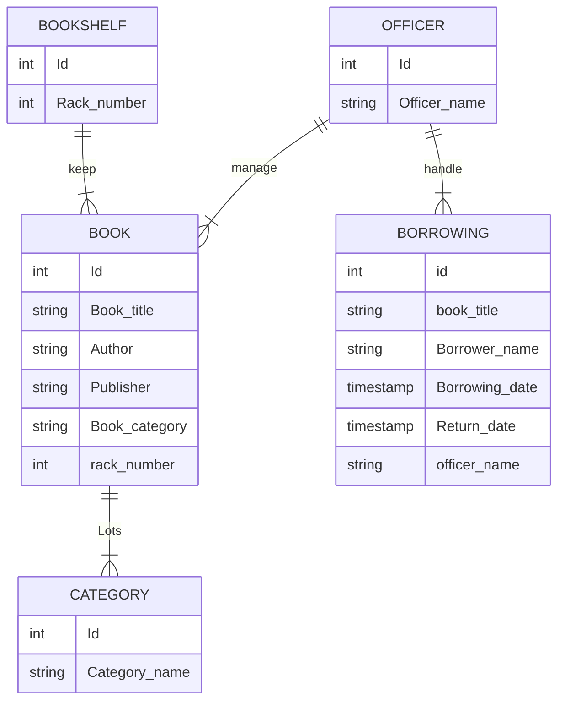
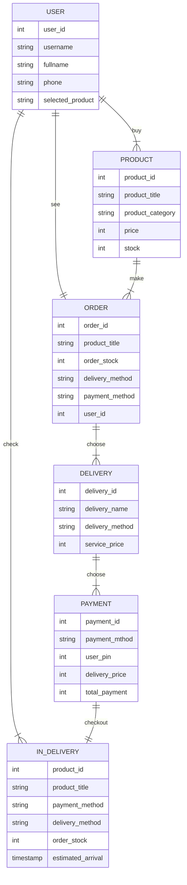

## Library ERD

```mermaid
erDiagram
    BOOK {
        int Id
        string Book_title
        string Author
        string Publisher
        string Book_category
        int rack_number
    }

    BOOK ||--|{ CATEGORY : Lots

    CATEGORY {
        int Id
        string Category_name
    }

    BOOKSHELF {
        int Id
        int Rack_number
    }
    BOOKSHELF ||--|{ BOOK : keep

    OFFICER {
        int Id
        string Officer_name
    }

    OFFICER ||--|{ BORROWING : handle

    BORROWING {
        int id 
        string book_title
        string Borrower_name
        timestamp Borrowing_date
        timestamp Return_date
        string officer_name
    }

    OFFICER ||--|{ BOOK : manage

```

## E-Commerce

```mermaid
erDiagram
    PRODUCT {
        int product_id
        string product_title
        string product_category
        int price
        int stock
    }

    USER ||--|{ PRODUCT : buy
    USER ||--|| ORDER : see
    USER ||--|{ IN_DELIVERY : check

    USER {
        int user_id
        string username
        string fullname
        string phone
        string selected_product
    }

    PRODUCT ||--|{ ORDER : make

    ORDER {
        int order_id
        string product_title
        int order_stock
        string delivery_method
        string payment_method
        int user_id
    }

    ORDER ||--|{ DELIVERY : choose

    PAYMENT {
        int payment_id
        string payment_mthod    
        int user_pin
        int delivery_price
        int total_payment
    }

    DELIVERY ||--|{ PAYMENT : choose

    DELIVERY {
        int delivery_id
        string delivery_name
        string delivery_method
        int service_price
    }

    PAYMENT ||--|| IN_DELIVERY : checkout

    IN_DELIVERY {
        int product_id
        string product_title
        string payment_method
        string delivery_method
        int order_stock
        timestamp estimated_arrival
    }

```